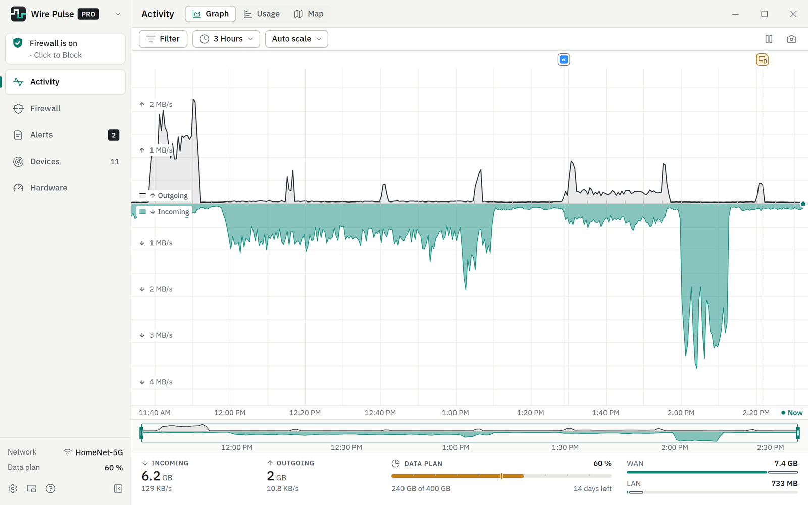
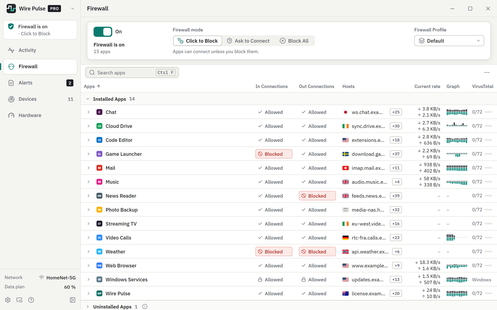
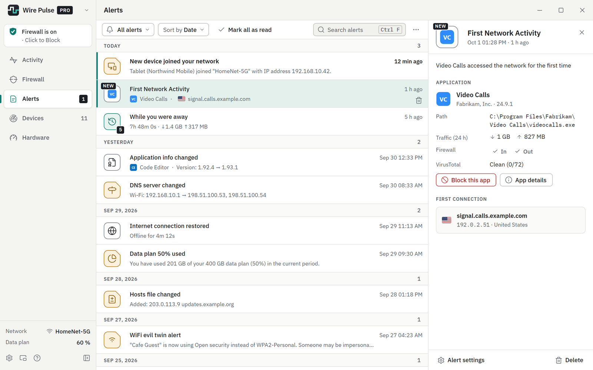
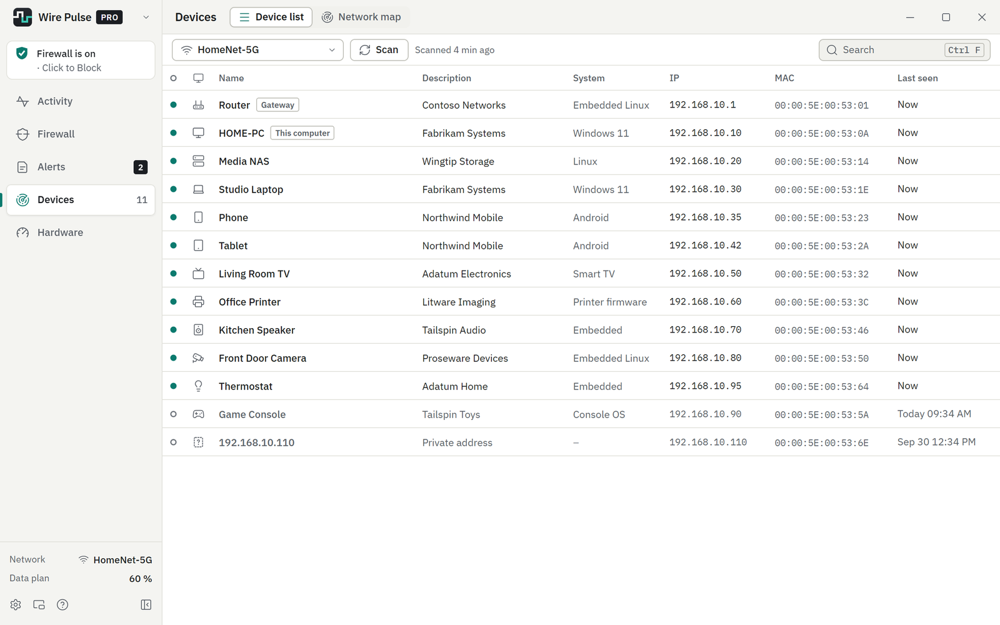
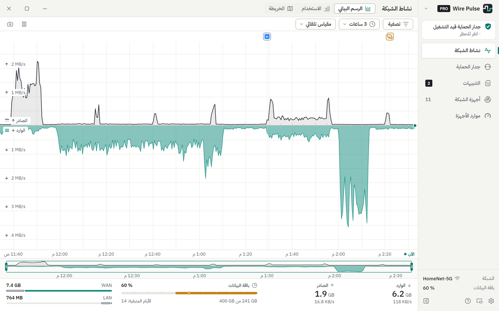
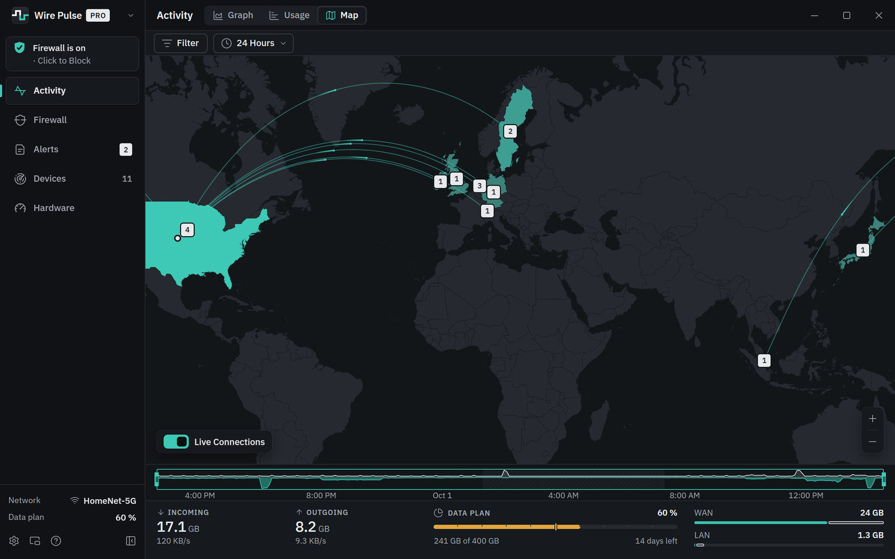
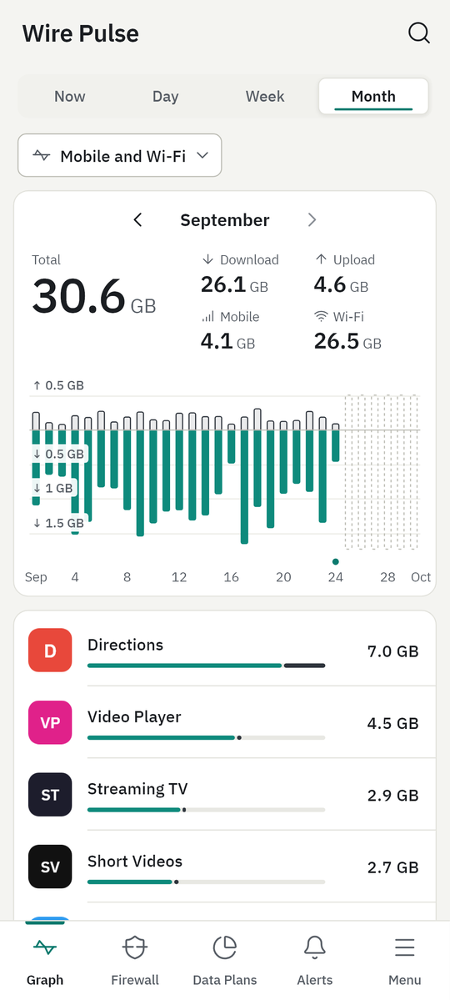
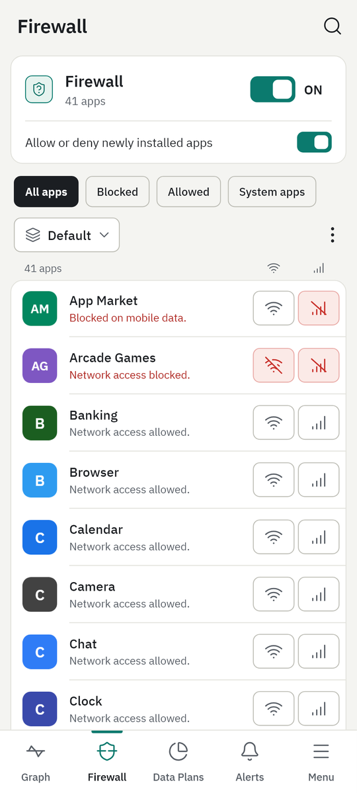
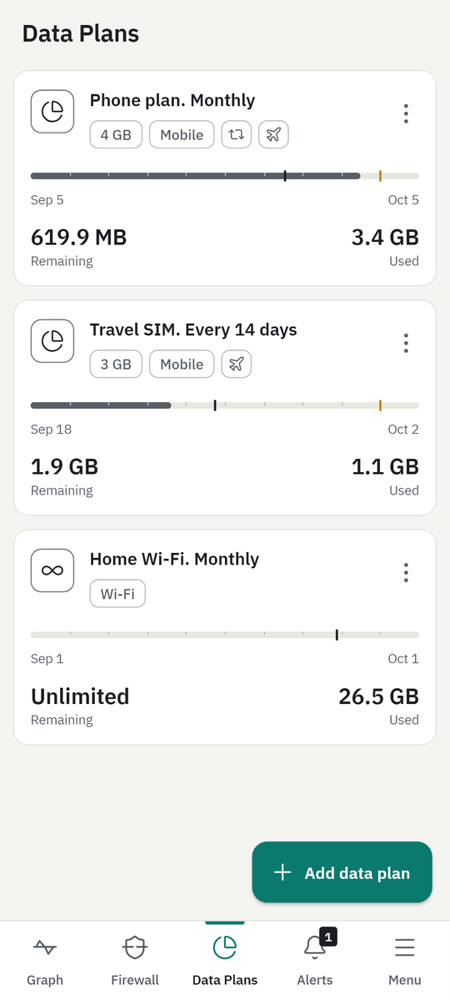
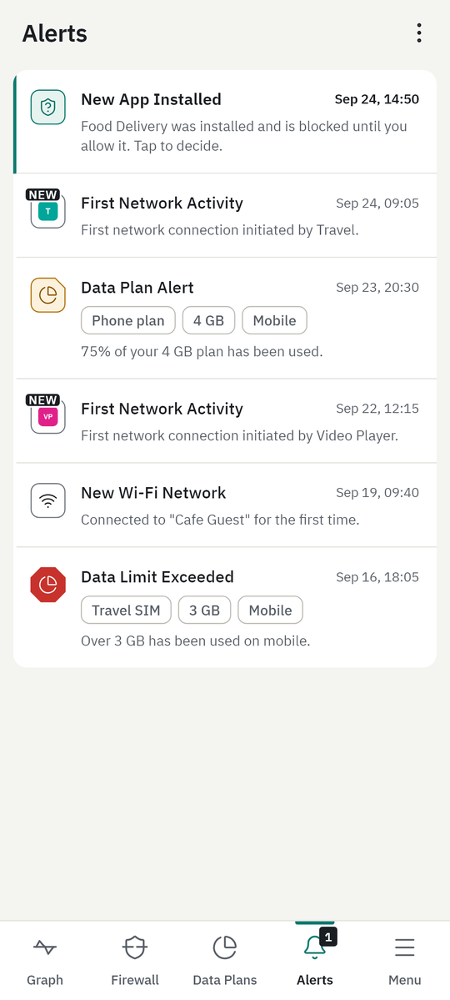

<h1 align="center">
  <picture>
    <source media="(prefers-color-scheme: dark)" srcset="assets/logo-on-dark.svg">
    
  </picture>
</h1>

  <b>See which apps use your internet connection, and decide which ones may.</b> 
  A network monitor and firewall for Windows and Android.

  <a href="https://github.com/0dteam/wirepulse/releases/latest"><b>Download for Windows</b></a>
  &nbsp;·&nbsp;
  <a href="https://github.com/0dteam/wirepulse/releases?q=android&amp;expanded=true"><b>Download for Android</b></a>
  &nbsp;·&nbsp;
  <a href="https://lab.0d.ae/wireplus/">Wire Pulse Pro</a>

Wire Pulse shows you how much data every app on your computer or phone uses, where that data goes, and when something
new happens: an app goes online for the first time, a new device joins your network, or your network settings change.
With its firewall you can cut any app off from the internet with one click. Everything it records stays on your
device.

Wire Pulse is free. Wire Pulse Pro adds unlimited history, more firewall modes and more alerts.

## Screenshots

### Windows

  

<b>Activity</b>: every app's traffic, live and back in time, with your data plan underneath.

  
  

<b>Firewall</b>: allow or block each app, in and out. &nbsp;·&nbsp; <b>Alerts</b>: know when something on your PC or network changes.

  
  

<b>Devices</b>: everything on your network. &nbsp;·&nbsp; Nine languages, including Arabic laid out right to left.

  

<b>Map</b>: where your data goes, here in the Dark theme.

### Android

  
  
  
  

<b>Usage</b> · <b>Firewall</b> · <b>Data plans</b> · <b>Alerts</b>

All screenshots show made-up demo data.

## Features

### Windows

- **Activity**: a live graph of everything your PC sends and receives, from the last five minutes back to months ago,
  with the apps behind every moment. See your usage by app, by destination and by country.
- **Firewall**: block any app from the internet with one click. With Pro, new apps wait until you allow them
  (*Ask to Connect*), *Block All* stops everything at once, and profiles keep different sets of rules.
- **Alerts** when an app goes online for the first time or changes, when your network settings change, when someone
  on your network may be pretending to be your router, when an app contacts a known dangerous address, when the
  internet drops, and when your data plan fills up. Pro adds alerts for remote desktop connections, look-alike Wi-Fi
  networks, unusual traffic and devices that join your network.
- **Devices**: everything connected to your network, with its name and maker.
- **Map** (Pro): a world map of where your data goes.
- **Hardware**: how busy your processor, memory, disk and graphics card are, also per app.
- **And more**: a data plan with warnings before you run out, Incognito mode, a summary of what happened while you were
  away, file checks with an online malware scanner, and with Pro the Mini Viewer desktop widget and a view of your
  other PCs.

### Android

- **Usage** of every app on Wi-Fi and mobile data, by day, week and month, and a live speed view.
- **Firewall, no root needed**: block any app on Wi-Fi, on mobile data or both. With Pro, newly installed apps wait until
  you allow them, and you can keep profiles. It works on the phone itself; nothing is sent anywhere.
- **Data plans** with warnings at 50, 75, 90 and 100 %; with Pro as many plans as you like, with roll-over of unused
  data and roaming.
- **Alerts** when an app goes online for the first time, a new app is installed, a plan fills up or you join a new
  Wi-Fi network.
- With Pro, a speed meter in the status bar and a home-screen widget.

Both apps speak nine languages: English, Deutsch, Español, Français, Português (Brasil), Русский, 日本語, 简体中文 and
العربية. They come in Light and Dark, with four more color themes in Pro.

### Free and Pro

| | Free | Pro |
|---|---|---|
| History | Last 30 days | Unlimited |
| Firewall | Block any app | Also: ask before new apps connect, Block All (Windows), profiles |
| Alerts | Core alerts | Also: remote desktop, new devices, look-alike Wi-Fi and unusual traffic (Windows); slow-downs (Android) |
| Extras | Light and Dark themes | Map, Mini Viewer, snoozing alerts, background device scans, your other PCs, four more themes, more data plans, speed meter, widget |

A Pro license works on Windows and on Android, on one device at a time, for one year or for life.
**[Get Wire Pulse Pro](https://lab.0d.ae/wireplus/)** and enter your key in the app (Settings → License on Windows,
Menu → Upgrade to Pro on Android).

## Download

- **Windows 10** (version 1809 or later) or **Windows 11**, 64-bit: download the installer from the
  [latest release](https://github.com/0dteam/wirepulse/releases/latest). A portable version that runs without
  installing is there too.
- **Android 8.0** or later: download the APK from the
  [Android releases](https://github.com/0dteam/wirepulse/releases?q=android&expanded=true), open it on your
  phone and allow the install when Android asks.

Wire Pulse for Windows keeps itself up to date. On Android, Wire Pulse lets you know when a new version is out.

## Privacy

- Your traffic history, alerts, firewall rules and data plans stay on your computer or phone. No account, no ads, no
  analytics.
- Wire Pulse goes online for its own work, such as looking for updates and checking a Pro license. Nothing about your
  traffic is ever sent to us.
- To show the names of the places your apps connect to, Wire Pulse for Windows looks them up the way your browser does.
  You can turn this off in Settings.

## Support

Questions, ideas or a problem? Write to [ask@0d.ae](mailto:ask@0d.ae). Licenses and Pro:
[lab.0d.ae/wireplus](https://lab.0d.ae/wireplus/).

---

© 2026 Wire Pulse · <a href="https://lab.0d.ae/wireplus/">lab.0d.ae/wireplus</a> 
The other folders in this repository are read by the apps to find and check updates; there is nothing to download
there.

